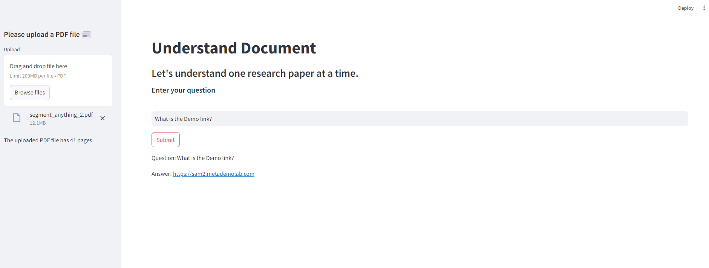

# Retrieval-Augmented Generation App Using LangChain and Llama Model

Developed a Streamlit-based user interface for uploading PDF files and enabling users to ask questions related to the content of the PDFs.

### Demo


### Technologies Used
- Open source Llama 3.1 8B model
- Ollama
- Langchain chains
- Langchain retriever
- ChromaDB
- Streamlit

### Installation

1. Install Ollama

Refer the https://ollama.com/download to install Ollama

2. Download open source Llama model using Ollama

Refer the https://ollama.com/library/llama3.1 to download the model

```ollama run llama3.1:8b```

3. Install dependencies

```pip install -r requirements.txt```

### Run the app
```streamlit run app.py```
